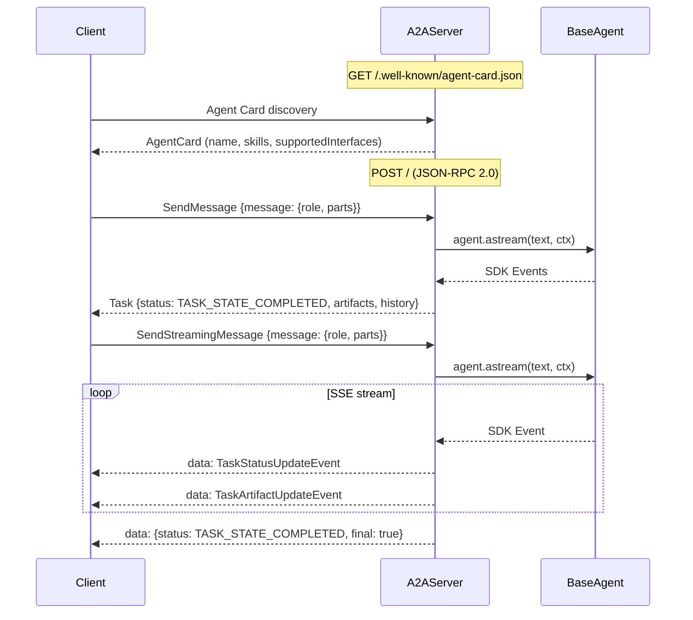
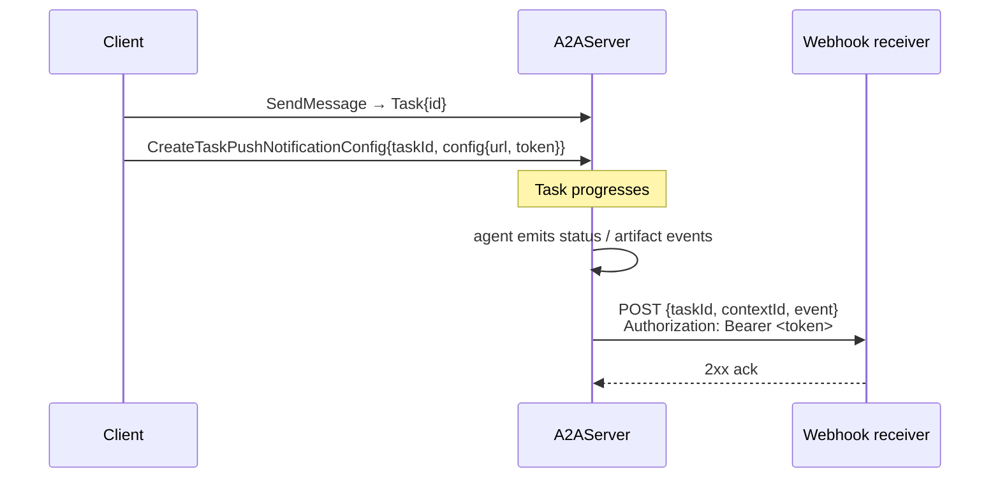

Expose any agent as a spec-compliant [A2A protocol](https://a2a-protocol.org/) endpoint (v1.0).



## Setup

```python
from orxhestra import LlmAgent, InMemorySessionService
from orxhestra.a2a import A2AServer, AgentSkill

agent = LlmAgent(name="MyAgent", model=model, tools=[...])

server = A2AServer(
    agent=agent,
    session_service=InMemorySessionService(),
    app_name="my-agent-service",
    skills=[
        AgentSkill(
            id="qa", name="Q&A",
            description="Answers general questions.",
            tags=["general"],
        ),
    ],
)

app = server.as_fastapi_app()
# uvicorn my_module:app --host 0.0.0.0 --port 8000
```

## Endpoints

| Method | Endpoint | Description |
|---|---|---|
| `GET` | `/.well-known/agent-card.json` | Agent Card discovery |
| `POST` | `/` | JSON-RPC 2.0 dispatch |

## JSON-RPC methods (v1.0)

| Method (PascalCase) | Slug alias | Description |
|---|---|---|
| `SendMessage` | `message/send` | Send a message, receive the completed `Task` |
| `SendStreamingMessage` | `message/stream` | Send a message, receive an SSE stream of `TaskStatusUpdateEvent` / `TaskArtifactUpdateEvent` |
| `GetTask` | `tasks/get` | Retrieve a task by id |
| `CancelTask` | `tasks/cancel` | Cancel a running task |
| `ListTasks` | `tasks/list` | Paginated history with optional `contextId` / `state` filters |
| `SubscribeToTask` | `tasks/resubscribe` | Re-attach to an existing task's SSE stream (e.g. after a client reconnect) |
| `GetExtendedAgentCard` | `agent/getAuthenticatedExtendedCard` | Fetch the agent card augmented with `extended_card_extras` |
| `CreateTaskPushNotificationConfig` | `tasks/pushNotificationConfig/set` | Register a webhook for a task |
| `GetTaskPushNotificationConfig` | `tasks/pushNotificationConfig/get` | Read one config |
| `ListTaskPushNotificationConfigs` | `tasks/pushNotificationConfig/list` | List all configs for a task |
| `DeleteTaskPushNotificationConfig` | `tasks/pushNotificationConfig/delete` | Remove one config |

<Note>
Both the PascalCase names and the spec slug aliases are accepted on every method, so you can call whichever your client library prefers.
</Note>

## Push notifications

Register an HTTPS webhook against a task; the server POSTs the
streaming events (status + artifact updates) as they happen.  Useful
when the client can't hold an SSE connection open for the full task
lifetime.



```python
from orxhestra.a2a import (
    A2AServer,
    InMemoryPushNotificationStore,
    PushNotificationDispatcher,
)

store = InMemoryPushNotificationStore()
server = A2AServer(
    agent=agent,
    session_service=InMemorySessionService(),
    push_notification_store=store,
    # During local development you can disable the SSRF guard:
    # allow_insecure_webhooks=True,
)
```

The default `PushNotificationDispatcher` SSRF-guards every URL: HTTPS
only, no `localhost`, no loopback / link-local / RFC1918 hosts.  Pass
`allow_insecure_webhooks=True` (or your own dispatcher) to relax this
for development.

## Task store extension

`A2AServer` stores tasks in an `InMemoryTaskStore` by default
(LRU-bounded at 10K entries).  Swap in a persistent backend by
implementing the `TaskStore` protocol:

```python
from orxhestra.a2a.store import TaskStore, InMemoryTaskStore
from orxhestra.a2a.types import Task, TaskState

class MyTaskStore(TaskStore):
    async def get(self, task_id: str) -> Task | None: ...
    async def put(self, task: Task) -> None: ...
    async def list(
        self, *,
        context_id: str | None = None,
        state: TaskState | None = None,
        limit: int = 50,
        cursor: str | None = None,
    ) -> tuple[list[Task], str | None]: ...
    async def delete(self, task_id: str) -> bool: ...

server = A2AServer(agent=agent, task_store=MyTaskStore())
```

## Spec compliance matrix

| v1.0 feature | Status |
|---|---|
| All 11 spec JSON-RPC methods | Supported |
| AgentCard required fields (`protocolVersion`, `defaultInputModes`, `defaultOutputModes`, `securitySchemes`, …) | Supported |
| SSE streaming (`SendStreamingMessage` + `SubscribeToTask`) | Supported |
| Push-notification webhook delivery | Supported (Bearer auth) |
| Pluggable `TaskStore` / `PushNotificationStore` | Supported |
| Ed25519 message signing + DID resolution | Supported |
| JWS-signed AgentCard `signatures` field | Schema-only (signing TBD) |
| OAuth 2.0 / OIDC enforcement middleware | Schema-only (`securitySchemes` advertised) |
| JWT / API-key / HMAC / Basic webhook auth | Bearer only this release |
| gRPC + REST bindings | Out of scope (JSON-RPC is the only advertised binding) |

## Example requests

<Tabs>
  <Tab title="Discover">
    ```bash
    curl http://localhost:8000/.well-known/agent-card.json
    ```
  </Tab>
  <Tab title="Send (blocking)">
    ```bash
    curl -X POST http://localhost:8000/ \
      -H "Content-Type: application/json" \
      -H "A2A-Version: 1.0" \
      -d '{
        "jsonrpc": "2.0", "id": "1",
        "method": "SendMessage",
        "params": {
          "message": {
            "role": "user",
            "parts": [{"text": "What is 2+2?", "mediaType": "text/plain"}]
          }
        }
      }'
    ```
  </Tab>
  <Tab title="Stream (SSE)">
    ```bash
    curl -N -X POST http://localhost:8000/ \
      -H "Content-Type: application/json" \
      -H "A2A-Version: 1.0" \
      -d '{
        "jsonrpc": "2.0", "id": "2",
        "method": "SendStreamingMessage",
        "params": {
          "message": {
            "role": "user",
            "parts": [{"text": "Tell me a story", "mediaType": "text/plain"}]
          }
        }
      }'
    ```
  </Tab>
</Tabs>

## A2A Client (A2AAgent)

Use `A2AAgent` to call a remote A2A server from within your agent tree:

```python
from orxhestra.agents.a2a_agent import A2AAgent

remote = A2AAgent(
    name="RemoteAgent",
    url="http://localhost:8000",
    description="A remote agent via A2A protocol.",
    streaming=True,   # opt into per-event SSE streaming
)

async for event in remote.astream("What is the weather?"):
    if event.is_final_response():
        print(event.text)
```

The agent also exposes the rest of the v1.0 method surface as
async helpers, all routed through the same JSON-RPC channel:

```python
# Discovery
card = await remote.fetch_agent_card()                # GET /.well-known/agent-card.json
ext  = await remote.fetch_agent_card(extended=True)   # GetExtendedAgentCard

# Task operations
result = await remote.list_tasks(limit=20)            # ListTasks
task   = await remote.get_task(task_id)               # GetTask
await remote.cancel_task(task_id)                     # CancelTask
async for ev in remote.subscribe_to_task(task_id):    # SubscribeToTask
    ...

# Push-notification configs
await remote.set_push_notification_config(            # CreateTaskPushNotificationConfig
    task_id, {"id": "p-1", "url": "https://hooks.example.com/wh"},
)
configs = await remote.list_push_notification_configs(task_id)
await remote.delete_push_notification_config(task_id, "p-1")
```

## v1.0 Protocol Details

A2A v1.0 uses:
- **PascalCase** JSON-RPC method names (`SendMessage`, not `message/send`)
- **Lowercase** role values (`user`, `agent`)
- **Unified Part type** with oneof content fields (`text`, `raw`, `url`, `data`) plus `mediaType`
- **`supportedInterfaces`** on AgentCard (replaces top-level `url`)
